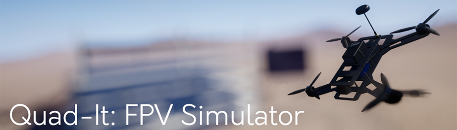

### Quad-It: FPV Simulator
[Free on itch.io](https://risenfield.itch.io/quad-it)

My first semi long term project made over the course of few months. I used this project to learn a lot of the basics of a solo game development workflow. All made using UE4, Blender, and Substance Painter.
### Notable Gameplay Features:
* Drone flight
  * Physics based forces for each propeller
* Course Editor
  * Place decorative props
  * Automatically create checkpoints
* Time Attack Flight
  * Race ghost recordings of fastest laps
* Free Flight
  * Explore the levels and fly around for fun
