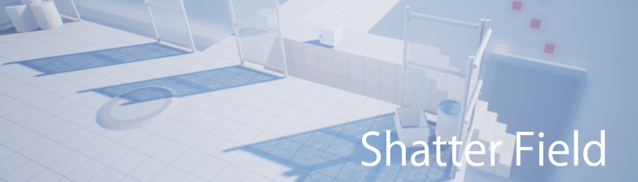

### Shatterfield
[Download Link](https://drive.google.com/file/d/1FJr1-sBrOnE5TqvgCGlapCtFv2KHA8GS)

Project I made over the course of a week for the 2016 Epic Megajam. I used this project to learn a lot about sticking to a schedule and meeting short term goals while maximising productivity.
### Notable Gameplay Features:
* Click and drag to shoot a bow and arrow at small npc enemies
  * Upgrade skills to improve the attacks; shooting multiple projectiles, faster speed etc...
* Fight basic npc enemies
* Traverse a linear world leading to a infinitely spawning test field
  * Simple level design with enemies carefully placed to cause interesting gameplay.
